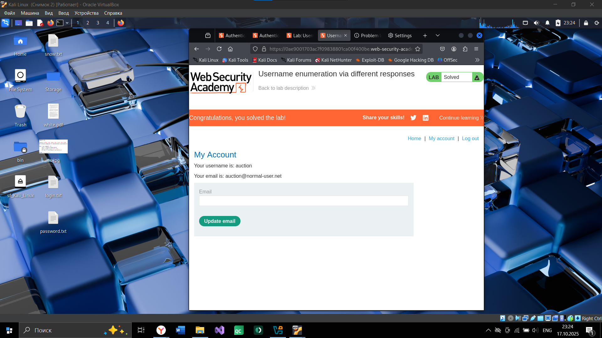

# Куприянова Юлия, 241-353 

### Задание 1. 
1. Нахожу ip-адрес Metasploitable3 с помощью команды: 
```
nmap -sn 192.168.0.0/24
```
\
2. Перехожу на сайт DVWA\ 
\
3. C помощью dirbuster провожу сканирование директории vulnerabilities\ 
\
Ответ: 4 директории\ 

### Задание 2.
1. Устанавливаю уровень безопасности DVWA Low\
\
2. Настраиваю Proxy в браузере для Burp Suite\
\
3. Вписываю рандомные логин, пароль и перехватываю GET запрос с ними\
\
4. В Intruder в режиме Cluster bomb провожу атаку, используя прикрепленный словарь, и нахожу нужную комбинацию\
\
Ответ: логин: admin, пароль: password\

### Задание 3.
1. Перейдя по ссылке, ввожу рандомные логин и пароль\
\
2. Перехватываю запрос с помощью Burp Suite и перенаправляю его в Intruder. Сканирую все логиы, прикрепленные в задании и нахожу верный - auction\
\
\
4. Затем меняю логин в запросе на "auction" и далее сканирую все пароли. Верный - michelle\
\
\

### Задание 4.
С помощью декодера определяю, что фраза закодирована в Base64. Декодировав ее, получаю: U vas poluchiloc\
\
