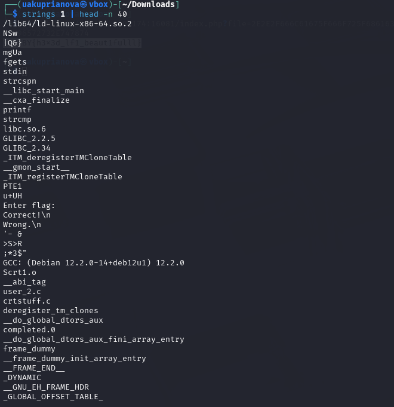

# Куприянова Юлия, 241-353 

### Задание "Странный файл"  
1. Проверяю файл в hex-редакторе, так как файл слишком много весит. Меняю расширение на .rar 

2. Открываю архив, вижу еще файл, тоже проверяю его в hex-реадкторе, меняю расширение на .zip

4. Нахожу в одном из архивов код, написанный на python


5. Меняю код и вывожу флаг в расшифрованном виде

```
Ответ: mospoly{x0r_4nd_b4s364_jUFSY7fd}
```

### Задание "Admin panel" 
1. Перехожу по данному в задании IP и ввожу рандомные данные для регистрации 

2. После регистрации перехожу в Admin panel, вижу флаг, но он неверный 

3. В HTTP history в запросе есть JWT-токен авторизации 

4. Отправляю запрос в Repeater, меняю роль и имя на admin, алгоритм на none и удаляю подпись в самом JWT 


5. Отправляю запрос и получаю флаг 

```
Ответ: CODEBY{I'M_G0NN4_H4V3_70_F1R3_7H3_C0D3R}
```

### Задание "PDF-библиотека" 
1. В файле в заголовке присутствует шестнадцатеричный код 
 
2. Если вместо имеющегося кода подставить index.php в 16-ричном формате, то файл не будет прогружаться 
 
3. Открываю pdf-файл с измененной ссылкой, в нем есть две закомментированные строки 
 
4. Название файла с флагом перевожу в 16-ричный код, добавив две точки и слеш, чтобы оказаться на директорию выше, и открывваю файл
 

```
Ответ: CODEBY{h3x3d_lf1_beaut1fulll}
```
### Задание Binary Reverse 
1. Извлекаю читаемые строчки из файла

2. В функциях бинарного файла ищу те, которые в названи содержат get_key 

3. Вывожу ассемблерный код только по адресам о 0x1220 до 0x1250 

4. Извлекаю данные из секции .rodata и сохраню в файл enc.hex 

5. С помощью кода нахожу флаг 

```
Ответ: FLAG{bin_user_2_A13f8f02} 
```
