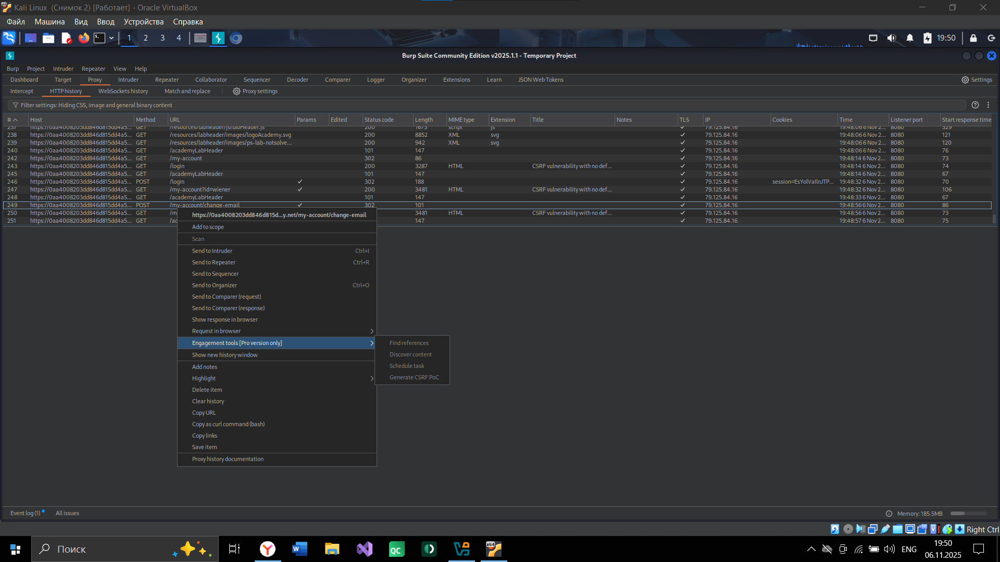
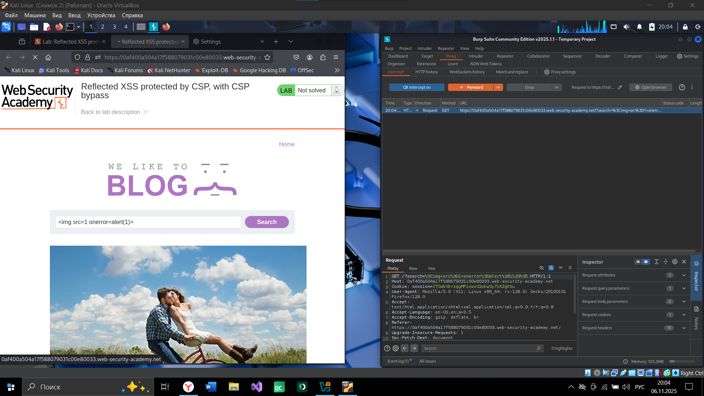
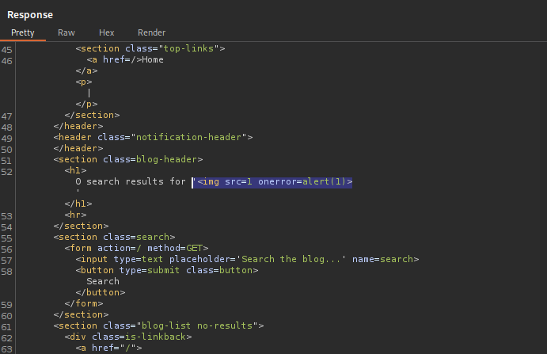
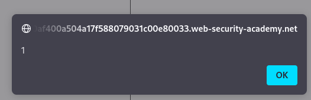
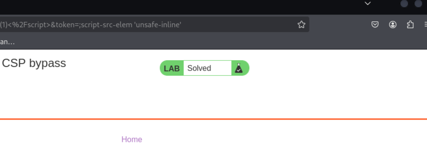
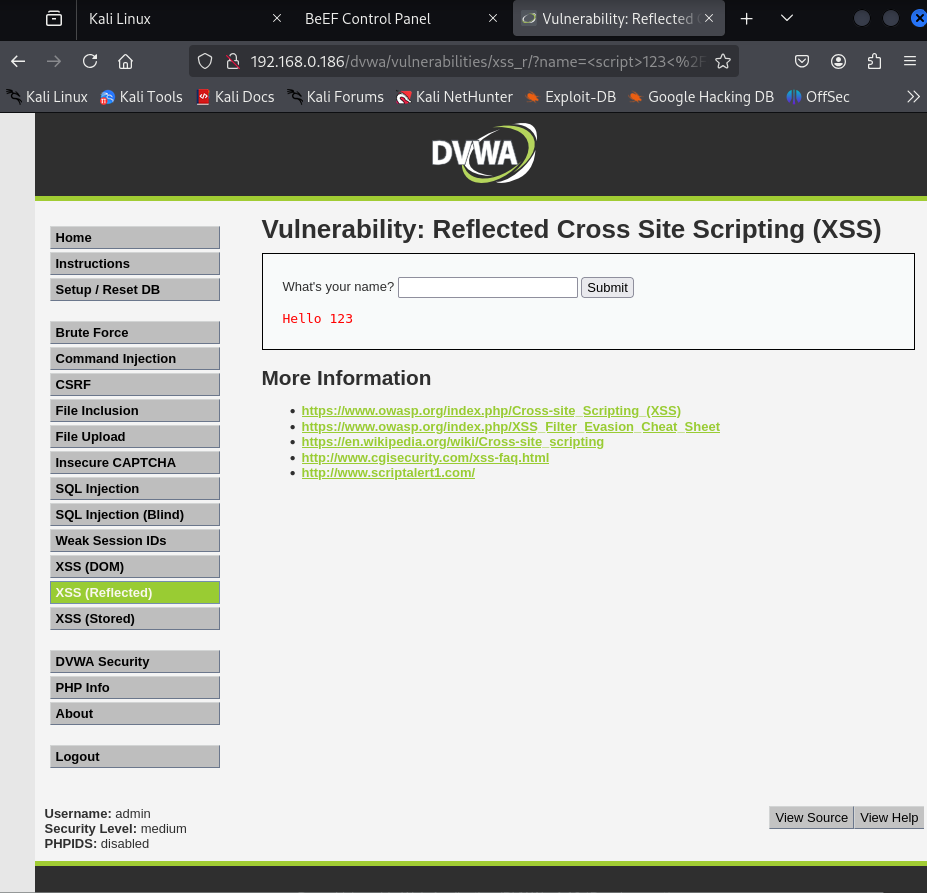
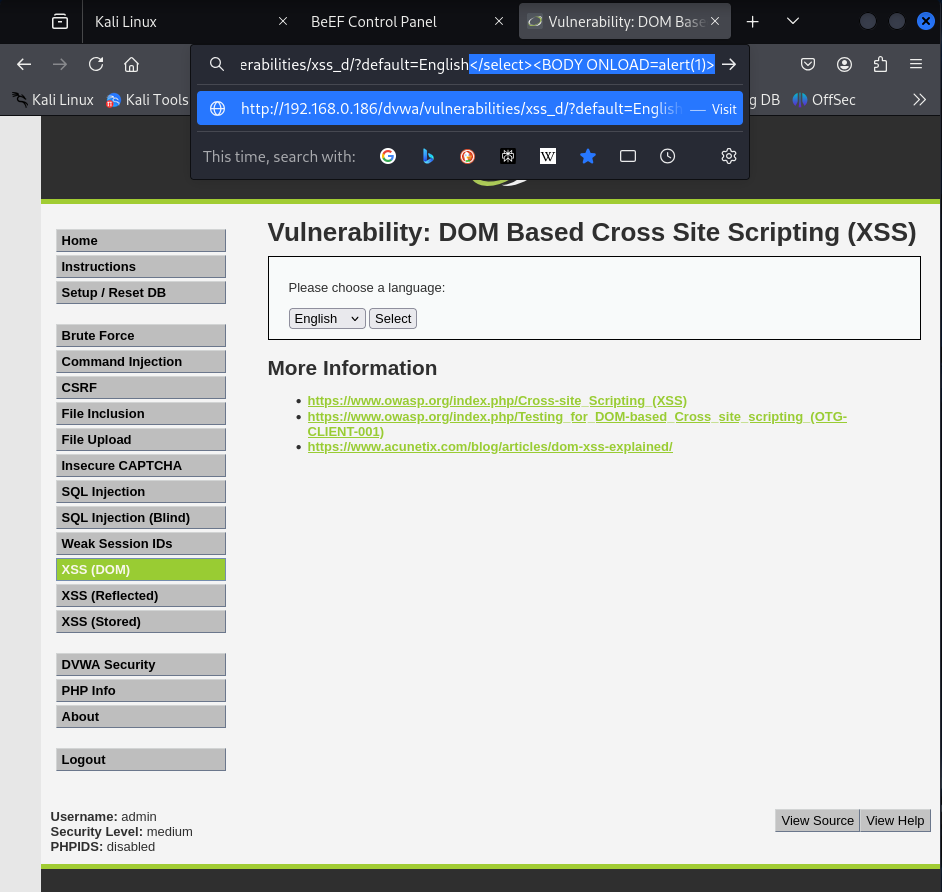
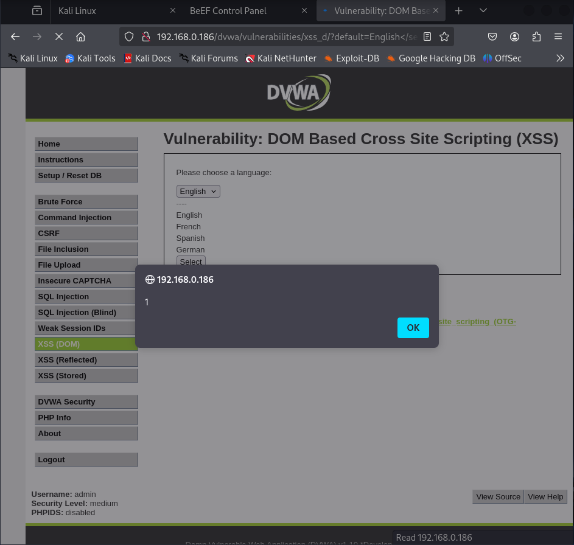
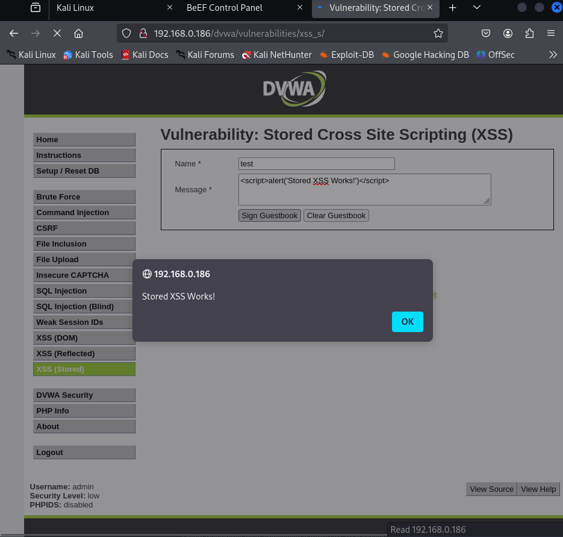
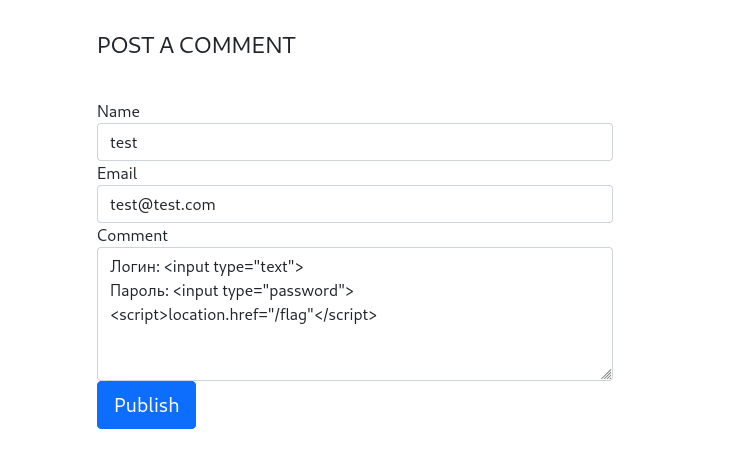

# Куприянова Юлия, 241-353  
## PortSwigger
### Задание 1. 
Ссылка задания ведет на блог, у которого под постами можно оставлять комментарии\


Можно провести DOM Clobbering атаку, перезаписав переменную defaultAvatar и выполнив XSS через onerror\


Оставляю второй комментарий, чтобы страница перезагрузилась и код выполнился\


### Задание 2. 
Вхожу в аккаунт и меняю почту, перехватывая запрос в Burp\


Дальше сделать не получилось, тк нужна про версия Burp\


### Задание 3.
В строку поиска добавляю скрипт и перехватываю запрос в Burp\


Полезная нагрузка отражается, но CSP препятствует выполнению скрипта\


Меняю токен, чтобы разрешить скрипт\






## DVWA
### Задание 1 - XSS (Reflected).
Создаю полезную нагрузку и ввожу ее в поле name, отправляя форму. Браузер жертвы подключился к BeEF


### Задание 2 - XSS (DOM).
В параметр default добавляю скрипт\


После перезагрузки страницы отобразилось всплывающее окно с подтверждение уязвимости\


### Задание 3 - XSS (Stored).
В поле Message ввожу полезную нагрузку, отправляю форму. Отображается уведомление, подтверждая наличие уязвимости\


### Задание.
Перехожу по ссылке, внизу страницы есть поле для ввода комментариев\


Ввожу комментарий с формой ввода информации, чтобы пользователя перевело на страницу с флагом\



## Конспекты 
### IPC: To Share Memory Or To Send Messages
```
https://www.youtube.com/watch?v=Y2mDwW2pMv4&t=37s
```

### Межпроцессное взаимодействие: механизмы и принципы работы
**Основные концепции IPC**\
Процесс представляет собой набор исполняемого кода, состояния процессора, области памяти и системных ресурсов. Для организации взаимодействия между процессами существуют два принципиально разных подхода:
1. Разделяемая память — процессы получают прямой доступ к общему участку памяти, что обеспечивает максимально быстрый обмен данными. Этот метод требует от процессов сознательного снятия ограничений изоляции и самостоятельной реализации механизмов синхронизации для предотвращения конфликтов при одновременном доступе к данным. Широко применяется в высокопроизводительных системах: браузерах для распределения задач между процессами, игровых движках, системах управления базами данных и фреймворках для глубокого обучения
2. Передача сообщений — процессы обмениваются данными через специальные очереди сообщений, которые полностью управляются ядром операционной системы. Для отправки и получения данных процессы используют системные вызовы. Хотя этот метод обычно медленнее из-за накладных расходов, он не требует организации общей памяти и упрощает взаимодействие процессов как в пределах одного компьютера, так и в распределённых системах по сети. Реализуется через различные механизмы, включая каналы, сокеты и удалённые вызовы процедур

### Why Applications Are Operating-System Specific
```
https://www.youtube.com/watch?v=eP_P4KOjwhs&t=47s
```

### Зависимость приложений от операционной системы
Возможность переноса программ между разными операционными системами ограничена фундаментальными различиями в нескольких ключевых аспектах:
1. Системные вызовы — каждый тип ОС предоставляет уникальный набор низкоуровневых интерфейсов для доступа к сервисам ядра. Процессор работает в двух режимах: защищённом пользовательском и привилегированном режиме ядра, и программы могут запрашивать услуги ОС только через строго определённый механизм прерываний с указанием номера системного вызова
2. Двоичный интерфейс приложения (ABI) — определяет детальные соглашения о способах передачи параметров (через регистры или стек), организации памяти и ширине адресов. Несовместимость на уровне ABI делает невозможным прямое выполнение программ, скомпилированных для одной ОС, в среде другой
3. Формат исполняемых файлов — каждая операционная система использует собственную структуру исполняемых файлов, которая содержит не только машинный код и данные, но и специфические метаданные, необходимые для компоновки, отладки и работы с динамическими библиотеками

### HOW TRANSISTORS REMEMBER DATA
```
https://www.youtube.com/watch?v=rM9BjciBLmg&t=29s
```

### Организация компьютерной памяти на аппаратном уровне
Основу запоминающих устройств составляют транзисторы, организованные в логические схемы с обратной связью. Фундаментальный элемент хранения информации — защёлка — строится из комбинаций логических вентилей (И, ИЛИ) и способна сохранять состояние одного бита. Управление осуществляется через специализированные сигналы: «разрешить запись» для сохранения нового значения и «разрешить чтение» для передачи сохранённого значения на выход\

Для создания запоминающих устройств значительной ёмкости отдельные защёлки объединяются в матричную структуру, где каждая ячейка памяти адресуется уникальной комбинацией сигналов строки и столбца с использованием декодеров. Такой подход позволяет использовать общую шину данных для всего массива памяти, что радикально сокращает количество необходимых физических соединений по сравнению с индивидуальным подключением каждой ячейки\

Для хранения данных размером в байт или машинное слово применяется параллельная организация из нескольких матриц, где каждая матрица отвечает за хранение одного определённого бита всех ячеек памяти. Это позволяет за одну операцию записывать или считывать все биты, составляющие единицу информации, по единому адресу

