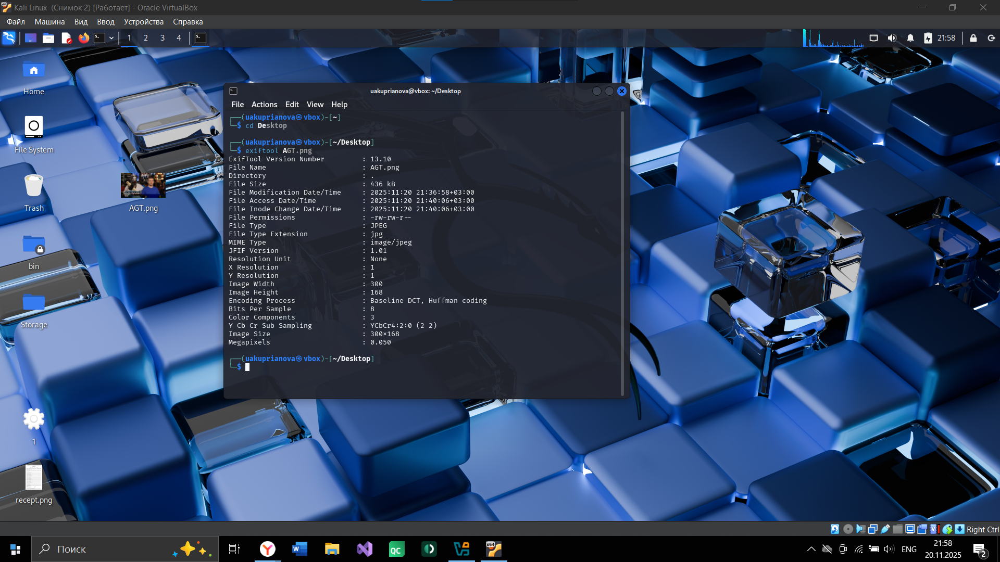
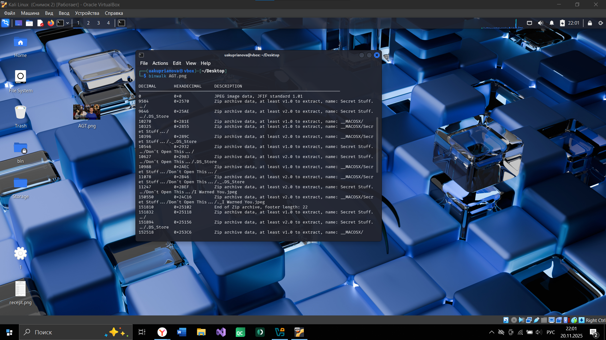
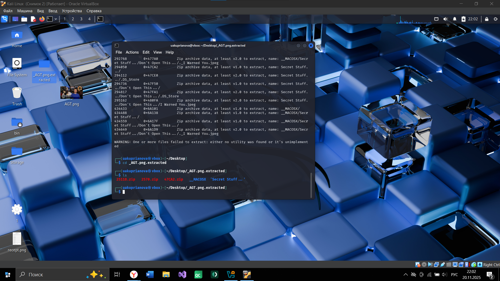
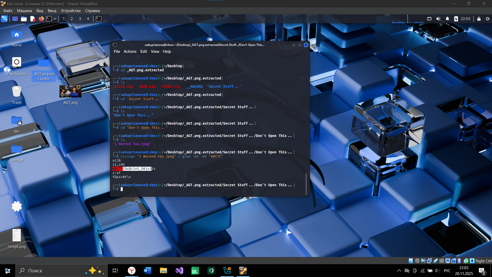
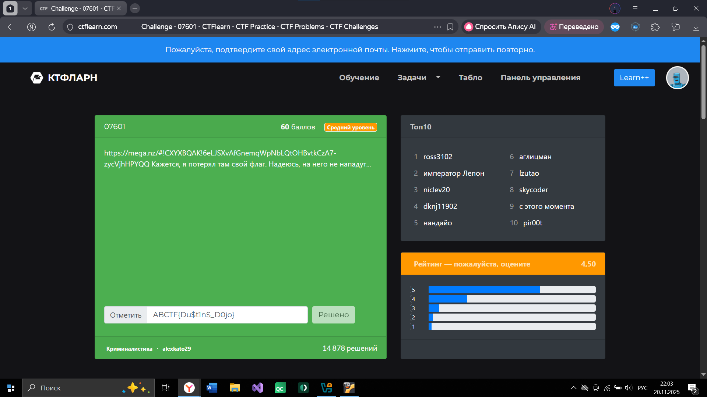

# Куприянова Юлия, 241-353  
### Задание 
```
https://ctflearn.com/challenge/97
```
Переходя по ссылке, скачиваю изображение. Сразу проверяю его метаданные командой exiftools AGT.png\


Файл является JPEG, а не PNG, поэтому ищу скрытые файлы внутри изображения\


Скрыто множество файлов. Извлекаю их и перехожу в созданную папку\


Дальше просматриваю извлеченные файлы и перехожу в "Secret Stuff..." - "Don`t Open This...". В последней папке есть файл "I Warned You.jpeg".


Извлекаю строки этого файла, сразу же отфильтровывая по началу флага, и нахожу флаг\




```
ABCTF{Du$t1nS_D0jo}
```
